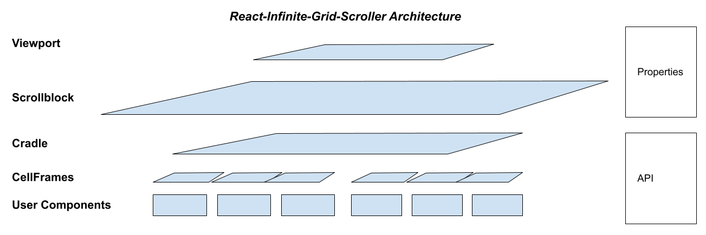

# react-infinite-grid-scroller (RIGS)
Vertical or horizontal infinite scroller using simple css grid layout

[](https://www.npmjs.com/package/react-infinite-grid-scroller)  [](https://github.com/HenrikBechmann/react-infinite-grid-scroller/blob/master/LICENSE.md)

# Key Features

- vertical or horizontal scrolling
- designed for "heavy" or "light" cell content (React components)
- supports both uniform and variable cell lengths (for both vertical and horizontal)
- single or multiple rows or columns
- limited sparse memory cache, to preserve content state, with an API
- repositioning mode when rapidly scrolling (such as by using the scroll thumb)
- dynamic pivot (horizontal/vertical back and forth) while maintaining position in list
- automatic reconfiguration with viewport resize
- dynamic recalibration with async content refresh
- supports nested lists

# Key Technologies

RIGS uses these key technologies:
- [css grid layout](https://css-tricks.com/snippets/css/complete-guide-grid/)
- [React hooks](https://reactjs.org/docs/hooks-intro.html)
- [React portals](https://www.npmjs.com/package/react-reverse-portal)
- [IntersectionObserver](https://developer.mozilla.org/en-US/docs/Web/API/Intersection_Observer_API)
- [ResizeObserver](https://developer.mozilla.org/en-US/docs/Web/API/ResizeObserver)
- [requestIdleCallback](https://developer.mozilla.org/en-US/docs/Web/API/Window/requestIdleCallback)

Therefore RIGS is best suited for modern browsers.

# Architecture



Notes: The `Cradle` is kept in view of the `Viewport`, such that the `axis` is always near the top or left of the `Viewport` (depending on vertical or horizontal orientation). There are two CSS grids in the `Cradle`, one on each side of the `axis`. As `CellFrame`s are added to or removed from the grids, the grid on the left expands toward or contracts away from the top or left of the `Scrollblock` (depending on orientation), and the grid on the right expands toward or contracts away from the bottom or right of the `Scrollblock`. 

`CellFrame`s display individual user components. `CellFrame`s are created and destroyed on a rolling basis as the `Cradle` re-configures and moves around the `Scrollblock` to stay in view, but user components are maintained in the internal cache until they go out of scope. New `CellFrame`s fetch user components from the internal cache (portals in the React virtual DOM) or from the host through the user-supplied `getItem` function, as needed.

Not shown are two triggerlines (0 `width` or `height` `div`s, depending on orientation) which straddle the top or left edge of the `Viewport`. Whenever one of these triggerlines crosses the `Viewport` edge (through scrolling), an `IntersectionObserver` sends an interrupt to the `Cradle` to update its content and configuration. Triggerlines are located in the last `CellFrame` of the head grid, unless the scroller is at the very top of the list, in which case the triggerlines are located in the first `CellFrame` of the tail grid.

# Usage

This is the minimum configuration.

```JSX
import Scroller from 'react-infinite-grid-scroller'

// ...

<div style = { containerstyle }>
  <Scroller 
      cellHeight = { cellHeight }
      cellWidth = { cellWidth }
      estimatedListSize = { estimatedListSize } // this constitutes a virtual 0-based array
      getItem = { getItem } // a function called by RIGS to obtain a specified user component by index number
  />
</div>
```
The scroller's highest level component, the `Viewport`, is a `div` with `position:absolute`, and `inset:0`, so the host container should be styled accordingly.

Note that scroller-generated elements show a `data-type` attribute in browser inspectors (eg. 'viewport').

User components loaded to CellFrames are placed in a `data-type` = 'contentenvelope' `div`. In 'uniform' layout this has `position` = 'absolute' and `inset` = 0. In 'variable' layout it has `width` = '100%' and a `max-height` = cellHeight for 'vertical' orientation, and `height` = '100%' and `max-width` = cellWidth for 'horizontal' orientation. In any case it has `overflow` = 'hidden'.

# Scroller properties

| property | value | notes |
|---|---|---|
|[_**REQUIRED**_]|
|cellHeight|integer: number of pixels for cell height|required. Applied to `height` for 'uniform' layout, 'vertical' orientation. Applied to `max-height` for 'variable' layout, 'vertical' orientation. Approximate, used for `fr` (fractional allocation) for 'horizontal' orientation |
|cellWidth|integer: number of pixels for cell width|required. Applied to `width` for 'uniform' layout, 'horizontal' orientation. Applied to `max-width` for 'variable' layout, 'horizontal' orientation. Approximate, used for `fr` (fractional allocation) for 'vertical' orientation|
|estimatedListSize|integer: the estimated number of items in the virtual list|required. Can be modified at runtime. Constitutes a 0-based virtual array|
|getItem|host-provided function. Parameters: `index` (integer, 0 based), and session `itemID` (integer) for tracking and matching. Arguments provided by system|required. Must return a React component or promise of a component (`React.isValidElement`), or `undefined` = unavailable, or `null` = end-of-list|
|[_**SCROLLER OPTIONS**_]|
|orientation|string: 'vertical' (default) or 'horizontal'|direction of scroll|
|layout|string: 'uniform' (default) or 'variable'|specifies handling of the height or width of cells, depending on orientation. 'uniform' is fixed cellHeight/cellWidth. 'variable' is constrained by cellHeight/cellWidth (maximum) and cellMinHeight/cellMinWidth (minimum)|
|startingIndex|integer: starting index when the scroller first loads|default = 0|
|padding|integer: number of pixels padding the `Cradle`| default = 0|
|[_**MORE CELL OPTIONS**_]|
|gap|integer: number of pixels between cells|there is no gap at start or end of rows or columns; default = 0|
|cellMinHeight|integer: default = 25, minimum = 25, maximum = cellHeight|used for 'variable' layout with 'vertical' orientation. Applied to `min-height`|
|cellMinWidth|integer: default = 25, minimum = 25, maximum = cellWidth|used for 'variable' layout with 'horizontal' orientation. Applied to `min-width`|
|[_**SYSTEM SETTINGS**_]|
|runwaySize|integer: number of rows in the `Cradle` just out of view at head and tail of list|default = 1. minimum = 1. Gives time to assemble cellFrames before display
|cache|string: 'cradle' (default), 'keepload', 'preload'|'cradle' matches the cache to the contents of the `Cradle`. 'keepload' keeps user components in the cache as loaded, up to `cacheMax` (and always `Cradle` user components). 'preload' loads user components up to `cacheMax`, then adjusts cache such that `Cradle` user components are always in the cache|
|cacheMax|integer: at minimum (maintained by system) the number of user components in the `Cradle`|allows optimization of cache size for memory limits and performance|
|useScrollTracker|boolean: default = `true`|allows suppression of system feedback on position within list while in reposition mode, if the host wants to provide alternative feedback based on data from callbacks |
|placeholder|a lightweight React component for `cellFrame`s to load while waiting for the intended `cellFrame` components|optional (replaces default placeholder). parameters are index, listsize, message, error. Arguments set by system|
|[_**OBJECTS**_]|
|styles|object: collection of styles for scroller components|optional. These should be "passive" styles like backgroundColor. See below for details|
|callbacks|object: collection of functions for feedback, and interactions with scroller components|optional. See below for details|
|technical|object: collection of values used to control system behaviour|use with caution. optional. See below for details|
|scrollerProperties|requested by user components by being set to null by user, instantiated with an object by system|required for nested RIGS; available for all user components. Contains key scroller settings. See below for details|

Notes: For explicit cache management capability, a unique session **`itemID`** (integer) is assigned to a user component as soon as it enters the cache. The `itemID` is retired as soon as the user component is removed from the cache. If the same component is re-introduced to the cache, it is assigned a new session-unique `itemID`. The `itemID` for a user component is given to the host with the `getItem` call to obtain the component, so that the host can track the user component in the cache. If the user component is assigned to a new `index` number (see the **returned function object** cache management section) the host will still be able to track the user component with the `itemID`. The host can track removal of a user component and its `itemID` from the cache through tracking its associated index removal through the `deleteListCallback` return value, and the return values from cache management functions. Most of the time this information can be ignored.

### `styles` object

Create a style object for each of the elements you want to modify. The styles are not screened, though the RIGS essential styles pre-empt user styles. Be careful to only include "passive" styles (like color, backgroundColor) so as not to confuse the scroller. Do not add structural items like borders, padding etc.

~~~typescript
styles = {
  viewport: {}, 
  scrollblock: {}, 
  cradle: {},
  scrolltracker: {},
  placeholderframe: {},
  placeholderliner: {},
}
~~~
The scrolltracker is the small rectangular component that appears at the top left of the viewport when the list is being rapidly repositioned. The scrolltracker shows the user the current index and total listsize during the repositioning process.

The placeholder styles are applied only to the default placeholder.

### `callbacks` object

Callbacks are host defined closure functions which the `Cradle` calls to provide data back to the host. `Cradle` returns data by setting the arguments of the callbacks. Include only the callbacks in the `callbacks` object that you want the `Cradle` to use. The following are recognized by the `Cradle`:
~~~typescript
callbacks: {

     // called at setup...
     functionsCallback, // (functions) - get api functions
     
     // index tracking, called when triggered...
     referenceIndexCallback, // (index, location, cradleState) - change of index adjacent to the axis
     repositioningIndexCallback, // (index) - current virtual index number during rapid repositioning
     preloadIndexCallback, // (index) - current index being preloaded
     itemExceptionsCallback, // (index, itemID, returnvalue, location, error) - details about failed getItem calls

     // operations tracking, called when triggered
     changeListsizeCallback, // (newlistsize) - triggered when the listsize changes for any reason
     deleteListCallback, // (reason, deleteList) - data about which items have been deleted from the cache
     repositioningFlagCallback, // (flag) - notification of start (true) or end (false) of rapid repositioning
     
}
~~~

An example of a callback closure (`functionsCallback`):
~~~typescript
const scrollerFunctionsRef = useRef(null)

const functionsCallback = (functions) => {

    scrollerFunctionsRef.current = functions // assign the returned functions object to a local Ref

}

//...

scrollerFunctionsRef.current.scrollToIndex(targetIndex)
~~~
Details about the callbacks:

|callback|parameters:datatypes|notes|
|---|---|---|
|[_**GET FUNCTIONS**_]|
|functionsCallback|functions: object|the object returned contains `Cradle` functions that the host can call directly. This is the API. `functionsCallback` is called once at startup. See below for details|
|[_**TRACK INDEXES**_]|
|referenceIndexCallback|index: integer, location: string, cradleState: string|location can be 'setCradleContent', 'updateCradleContent'. Keeps the host up to date on the index number adjacent to the `Cradle` axis, and the state change that triggered the update|
|repositioningIndexCallback|index: integer|the current index during repositioning. Useful for feedback to user when host sets `useScrollTracker` property to false|
|preloadIndexCallback|index: integer|during a preload operation, this stream gives the index number being preloaded|
|itemExceptionsCallback|index: integer, itemID: integer, returnvalue: any, location: string, error: Error|triggered whenever getItem does not return a valid React component|
|[_**TRACK OPERATIONS**_]|
|changeListsizeCallback|newlistsize: integer|notification of a change of list size. Could be from getItem returning null indicating end-of-list, or an API call that results in change of list size|
|deleteListCallback|reason: string, deleteList: array|gives an array of indexes that have been deleted from the cache, and text of the reason|
|repositioningFlagCallback|flag: boolean| called with `true` when repositioning starts, and `false` when repositioning ends. Useful for feedback to user when host sets `useScrollTracker` property to false|

### returned `functions` object

Details about the functions returned in an object by `functionsCallback`:

|function|parameters: datatypes|return value: datatype|notes|
|---|---|---|---|
|[_**OPERATIONS**_]|
|scrollToIndex|index:integer|_void_|places the requested index item at the top visible row or left visible column of the scroller, depending on orientation|
|setListsize|index:integer|_void_|changes the list size|
|reload|_none_|_void_|clears the cache and reloads the `Cradle` at its current position in the virtual list|
|clearCache|_none_|_void_|clears the cache and the `Cradle` (leaving nothing to display)|
|[_**SNAPSHOTS**_]|
|getCacheIndexMap|_none_|map: Map|snapshot of cache index (=key) to itemID (=value) map|
|getCacheItemMap|_none_|map: Map|snapshot of cache itemID (=key) to object (=value) map. Object = {index, component} where component = user component|
|getCradleIndexMap|_none_|map: Map|snapshot of `Cradle` index (=key) to itemID (=value) map|
|[_**CACHE MANAGEMENT**_]|
|insertIndex|index:integer, rangehighindex = null:integer or null|changeList:array, replaceList:array|can insert a range of indexes. Displaced indexes, and higher indexes, are renumbered. Changes the list size; synchronizes the `Cradle`|
|removeIndex|index:integer, rangehighindex = null:integer or null|changeList:array, replaceList:array|a range of indexes can be removed. Higher indexes are renumbered. Changes the list size; synchronizes to the `Cradle`|
|moveIndex|toindex:integer, fromindex:integer, highrange = null:integer or null|processedIndexList:array|a range of indexes can be moved. Displaced and higher indexes are renumbered. Changes the list size; synchronizes to the `Cradle`|
|remapIndexes|changeMap:Map|modifiedIndexList:array, processedIndexList:array, indexesToDeleteList:array, deletedOrphanedItemIDList:array, deletedOrphanedIndexList:array, errorEntriesMap:Map, changeMap:Map (same as input parameter)|changeMap is index (=key) to itemID (=value) map. indexes or itemIDs not in the cache are ignored. `itemID`s are assigned to the new indexes; synchronizes to the `Cradle`|

Notes: cache management functions are provided to support drag-n-drop, sorting, and filtering operations. Cache management functions operate on indexes and items in the cache, and generally ignore indexes and items that are not in the cache. This is a sparse cache, and indexes in the cache are not guaranteed to be contiguous.

### `technical` object

These properties would rarely be changed.

|property|value|notes|
|---|---|---|
|showAxis |boolean, default = false |axis can be made visible for debug|
|triggerlineOffset|integer, default = 10| distance from cell head or tail for content shifts above/below axis|
|VIEWPORT_RESIZE_TIMEOUT|integer, default = 250|milliseconds before the Viewport resizing state is cleared|
|SCROLL_TIMEOUT_FOR_ONAFTERSCROLL|integer, default = 100|milliseconds after last scroll event before onAfter scroll event is fired|
|IDLECALLBACK_TIMEOUT|integer, default = 4000|milliseconds timeout for requestIdleCallback|
|TIMEOUT_FOR_VARIABLE_MEASUREMENTS|integer, default = 100|milliseconds to allow setCradleContent changes to render before being measured for 'variable' layout|
|MAX_CACHE_OVER_RUN|number, default = 1.5|max streaming cache size over-run (while scrolling) as ratio to cacheMax|

### `scrollerProperties` object

Nested RIGS require this property (to be informed when portal reparenting is taking place).

orientation, 
gap, 
padding, 
cellHeight, 
cellWidth,
cellMinHeight,
cellMinWidth, 
layout,
cache,
cacheMax,
startingIndex, 

runwayRowcount,

# Licence

MIT &copy; 2020 [Henrik Bechmann](https://twitter.com/HenrikBechmann)
