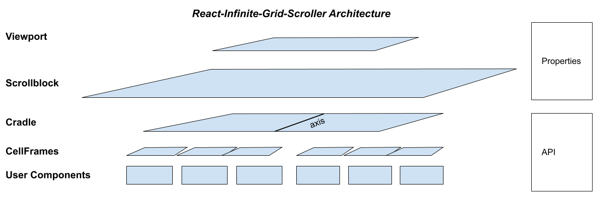

# react-infinite-grid-scroller (RIGS)
Heavy-duty vertical or horizontal infinite scroller

[](https://www.npmjs.com/package/react-infinite-grid-scroller) [](LICENSE.md)

# Key Features

- intra-list and inter-list drag and drop (optional)
- vertical or horizontal scrolling
- designed to display both "heavy" and "light" cell content (React components)
- supports both uniform and variable cell lengths (for both vertical and horizontal)
- single or multiple rows or columns
- dynamically variable virtual list size; prepend or append infinitely
- limited sparse in-memory cache, to preserve content state, with an API
- repositioning mode when rapidly scrolling
- dynamic pivot (horizontal/vertical back and forth) while maintaining position in list
- automatic reconfiguration with viewport resize
- dynamic recalibration with async content refresh
- supports nested RIGS scrollers

# Demo Site

See the [demo site](https://henrikbechmann.github.io/rigs-demo/).

# Key Technologies

RIGS uses these key technologies:
- [CSS grid](https://css-tricks.com/snippets/css/complete-guide-grid/)
- [React hooks](https://react.dev/reference/react)
- [React portals](https://www.npmjs.com/package/react-reverse-portal)
- [IntersectionObserver](https://developer.mozilla.org/en-US/docs/Web/API/Intersection_Observer_API)
- [ResizeObserver](https://developer.mozilla.org/en-US/docs/Web/API/ResizeObserver)
- [requestIdleCallback](https://developer.mozilla.org/en-US/docs/Web/API/Window/requestIdleCallback)
- [react-dnd](https://www.npmjs.com/package/react-dnd)

Therefore RIGS is best suited for modern browsers.

# Architecture



Notes: The `Cradle` is kept in view of the `Viewport`, such that the `axis` is always near the top or left of the `Viewport` (depending on vertical or horizontal orientation). There are two CSS grids in the `Cradle`, one on each side of the `axis`. As `CellFrame`s are added to or removed from the grids, the grid on the top or left expands toward or contracts away from the top or left of the `Scrollblock` (depending on orientation), and the grid on the bottom or right expands toward or contracts away from the bottom or right of the `Scrollblock`. 

`CellFrame`s display individual user components. `CellFrame`s are created and destroyed on a rolling basis as the `Cradle` re-configures and moves around the `Scrollblock` to stay in view, but user components are maintained in the internal cache until they go out of scope. New `CellFrame`s fetch user components from the internal cache (portals in the React virtual DOM) or from the host through the user-supplied `getItemPack` function, as needed.

Not shown are two triggerlines (0 `width` or `height` `div`s, depending on orientation) which straddle the top or left edge of the `Viewport`. Whenever one of these triggerlines crosses the `Viewport` edge (through scrolling), an `IntersectionObserver` sends an interrupt to the `Cradle` to update its content and configuration. Triggerlines are located in the last `CellFrame` of the head grid, unless the scroller is at the very top of its list, in which case the triggerlines are located in the first `CellFrame` of the tail grid.

# Usage

This is the minimum configuration.

```JSX
import Scroller from 'react-infinite-grid-scroller'

// ...

const lowindex = -50, highindex = 50 // random range values

<div style = { containerstyle }>
  <Scroller 
      cellHeight = { cellHeight }
      cellWidth = { cellWidth }
      startingListRange = { [lowindex, highindex] } // this constitutes the virtual list
      getItemPack = { getItemPack } // a function called by RIGS to obtain a specified user component by index number
  />
</div>
```
See below for drag and drop configuration.

The scroller's highest level component, the `Viewport`, is a `div` with `position:absolute`, and `inset:0`, so the host container should be styled accordingly.

Note that scroller-generated elements show a `data-type` attribute in browser inspectors (eg. 'viewport').

User components loaded to `CellFrame`s are placed in a `data-type = 'contentenvelope'` `div`. In 'uniform' layout this has `position:absolute` and `inset:0`. In 'variable' layout it has `width:100%` and `max-height` = `cellHeight` for 'vertical' orientation, and `height:100%` and `max-width` = `cellWidth` for 'horizontal' orientation. These elements allow overflow, but the user components should have `overflow:hidden` as appropriate.

See the "Content Types" section of the [demodata.tsx](https://github.com/HenrikBechmann/rigs-demo/blob/master/src/demodata.tsx) module of the demo site for more code examples.

# Compatible browsers

RIGS works on Chrome, Microsoft Edge, Firefox and Safari.

   

# Scroller properties

| property | value | notes |
|---|---|---|
|[_**CELL CONFIGURATION**_]|
|cellHeight:integer| number of pixels for cell height|required. Applied to `height` for 'uniform' layout, 'vertical' orientation. Applied to `max-height` for 'variable' layout, 'vertical' orientation. Approximate, used for `fr` (fractional allocation) for 'horizontal' orientation |
|cellWidth:integer| number of pixels for cell width|required. Applied to `width` for 'uniform' layout, 'horizontal' orientation. Applied to `max-width` for 'variable' layout, 'horizontal' orientation. Approximate, used for `fr` (fractional allocation) for 'vertical' orientation|
|cellMinHeight:integer| default = 25, minimum = 25, maximum = cellHeight|used for 'variable' layout with 'vertical' orientation. Applied to `min-height`|
|cellMinWidth:integer| default = 25, minimum = 25, maximum = cellWidth|used for 'variable' layout with 'horizontal' orientation. Applied to `min-width`|
|gap:integer \| []| number of pixels between cells|there is no gap at start or end of rows or columns; default = 0; accepts an array of integers as well as a standalone integer. Values match standard CSS order. Standalone integer = gap (in pixels) for both of column-gap (horizontal) and row-gap (vertical). 1-item array, same as integer. 2-item array = [col-gap, row-gap]|
|getItemPack(index:integer, itemID:integer, context:object): object |host-provided function. `index` signifies position in list; session `itemID` (integer) is for tracking and matching. `context` provides an `accept` property when dnd is installed. Arguments provided by system|required. Must return a simple object with three properties: `component` - a React component or promise of a component (`React.isValidElement`), `dndOptions` (if dnd is enabled; see Drag and Drop section), and `profile`- a simple host-defined object which gets returned to the host for identification in various contexts|
|[_**LIST CONFIGURATION**_]|
|startingListRange:[lowindex, highindex] \| []|two part array , or empty array []|lowindex must be <= highindex; both can be positive or negative integers. [] (empty array) creates an empty virtual list. Can be modified at runtime. |
|startingIndex:integer| starting index when the scroller first loads|default = 0|
|orientation:string| 'vertical' (default) or 'horizontal'|direction of scroll|
|layout:string| 'uniform' (default) or 'variable'|specifies handling of the height or width of cells, depending on orientation. 'uniform' is fixed cellHeight/cellWidth. 'variable' is constrained by cellHeight/cellWidth (maximum) and cellMinHeight/cellMinWidth (minimum)|
|padding:integer \| []| number of pixels padding the `Scrollblock`| default = 0; accepts an array of integers as well as a standalone integer. Values match standard CSS order. Standalone integer = padding (in pixels) for all of top, right, bottom, left. 1-item array, same as integer. 2-item array = [t/b, r/l]. 3-item array = [t, r/l, b]. 4-item array = [t, r, b, l]|
|getExpansionCount(position:string, index:ingeger): integer| function optionally provided by host. Called whenever the lowindex or highindex are loaded into the Cradle.| `position` = "SOL" or "EOL"; index = the lowindex or highindex. Should return the number by which to expand the virtual list|
|getDropEffect(sourceScrollerID, targetScrollerID, context): 'move' \| 'copy'\| 'none' \| `undefined`|function, optional, for `RigsDnd` component only|called whenever drag `isOver` and `canDrop` are true on a list; returns drop constraint. See Drag and Drop below. |
|[_**SYSTEM SETTINGS**_]|
|dndOptions:object|scroller settings for drag and drop|required if drag and drop is enabled. See Drag and Drop section|
|runwaySize:integer| number of rows in the `Cradle` just out of view at head and tail of list|default = 1. minimum = 1. Gives time to assemble cellFrames before display
|cache:string| 'cradle' (default), 'keepload', 'preload'|'cradle' matches the cache to the contents of the `Cradle`. 'keepload' keeps user components in the cache as loaded, up to `cacheMax` (and always `Cradle` user components). 'preload' loads user components up to `cacheMax`, then adjusts cache such that `Cradle` user components are always in the cache|
|cacheMax:integer| at minimum (maintained by system) the number of user components in the `Cradle`|allows optimization of cache size for memory limits and performance|
|useScrollTracker:boolean| default = `true`|allows suppression of system feedback on position within list while in reposition mode, if the host wants to provide alternative feedback based on data from callbacks |
|placeholder:React.FC|a lightweight React component for `cellFrame`s to load while waiting for the intended `cellFrame` components|optional (replaces default placeholder). parameters are index, listsize, message, error, dndEnabled. Arguments set by system|
|usePlaceholder:boolean| default = true|allows suppression of use of default or custom placeholder. Placeholders show messages to the user while user components are fetched, and report errors|
|[_**OBJECT PROPERTIES**_]|
|styles:object| collection of styles for scroller components|optional. These should be "passive" styles like backgroundColor. See below for details|
|placeholderMessages:object| messages presented by the placeholder|optional, to replace default messages. See below for details|
|callbacks:object| collection of functions for feedback, and interactions with scroller components|optional. See below for details|
|technical:object| collection of values used to control system behaviour|use with caution. optional. See below for details|

Notes: For explicit cache management capability, a unique session `itemID` (integer) is assigned to a user component as soon as it enters the cache. The `itemID` is retired as soon as the user component is removed from the cache. If the same component is re-introduced into the cache, it is assigned a new session-unique `itemID`. 

The `itemID` for a user component is given to the host with the `getItemPack` call to obtain the component, so that the host can track the user component in the cache. If the user component is assigned to a new `index` number (see the **returned function object** cache management section below) the host will still be able to track the user component with the `itemID`. 

The host can track removal of a user component and its `itemID` from the cache through tracking its associated index removal through the `deleteListCallback` return values, and the return values from cache management functions. These feedback mechanisms also return the host's item `profile` object for further identification. See callback documentation below.

Most of the time the `itemID` can be ignored.

Also, note that the cache is reloaded with a new `getItemPack` function.

### `styles` object

Create a style object for each of the elements you want to modify. The styles are not screened, though the RIGS essential styles pre-empt user styles. Be careful to only include "passive" styles (like color, backgroundColor) so as not to confuse the scroller. Do not add structural items like borders, padding etc.

~~~typescript
styles = {
  viewport: {}, 
  scrollblock: {}, 
  cradle: {},
  scrolltracker: {},
  placeholderframe: {},
  placeholderliner: {},
  placeholdererrorframe: {},
  placeholdererrorliner: {},
  dndDragIcon: {},
  dndHighlights:{ // provide a color string for any you want to change
    source, // default "darkorange"
    target, // default "black"
    dropped, // default "darkorange"
    scroller, // default "red", canDrop but not isOver scroller
    scrolltab, // default "brown", also used for isOver and canDrop scroller
  },
~~~

You may want to add `overscrollBehavior:'none'` to the top level viewport styles to prevent inadvertent reloading of your app in certain browsers when users scroll past the top of a vertical list. Also note that dndDragIcon needs `zIndex` to be at least `1`.

The scrolltracker is the small rectangular component that appears at the top left of the viewport when the list is being rapidly repositioned. The scrolltracker shows the user the current virtual position (index + 1) and total listsize during the repositioning process.

The placeholder styles are applied only to the default placeholder.

### `placeholderMessages` object

Replace any of the default messages used by the placeholder.

~~~typescript
const placeholderMessages = {
    loading:'(loading...)',
    retrieving:'(retrieving from cache)',
    undefined:'host returned "undefined"', // displayed, and returned with itemExceptionCallback
    invalid:'invalid React element', // displayed, and returned with itemExceptionCallback
}
~~~

### `callbacks` object

Callbacks are host-defined closure functions which RIGS calls to provide data back to the host. RIGS returns data by setting the arguments of the callbacks. Include only the callbacks in the `callbacks` object that you want RIGS to use. The following callbacks are recognized by RIGS:
~~~typescript
callbacks: {

     // called at setup...
     functionsCallback, // (functions) - get an object that has api functions
     
     // index tracking, called when triggered...
     referenceIndexCallback, // (index, context) - change of index adjacent to the axis
     repositioningIndexCallback, // (index, context) - current virtual index number during rapid repositioning
     preloadIndexCallback, // (index, context) - current index being preloaded
     itemExceptionCallback, // (index, context) - details about failed getItemPack calls

     // operations tracking, called when triggered
     changeListRangeCallback, // (listrange, context) two part array lowindex, highindex 
     deleteListCallback, // (deleteList, context) - data about which items have been deleted from the cache
     boundaryCallback, // (position, index, context) - position is "SOL" or "EOL", index is the corresponding boundary index
     repositioningFlagCallback, // (flag, context) - notification of start (true) or end (false) of rapid repositioning,
}
~~~

An example of a callback closure (`functionsCallback`):
~~~typescript
const scrollerFunctionsRef = useRef(null)

const functionsCallback = (functions) => {

    scrollerFunctionsRef.current = functions // assign the returned functions object to a local Ref

}

//...

scrollerFunctionsRef.current.scrollToIndex(targetIndex)
~~~
Details about the callbacks:

|callback function (parameters:datatypes)|context object parameter|notes|
|---|---|---|
|[_**GET FUNCTIONS**_]|
|functionsCallback(functions: object)||the object returned contains `Cradle` functions that the host can call directly. This is the API. `functionsCallback` is called once at startup. See below for details|
|[_**TRACK INDEXES**_]|
|referenceIndexCallback(index: integer, context:object)|contextType: 'referenceIndex', action, cradleState, scrollerID|`action` can be 'setCradleContent' or 'updateCradleContent'. `cradleState` is the state change that triggered the action. Keeps the host up to date on the index number adjacent to the `Cradle` axis|
|repositioningIndexCallback(index: integer, context:object)|contextType: 'repositioningIndex', scrollerID|the current index during repositioning. Useful for feedback to user when host sets `useScrollTracker` property to false|
|preloadIndexCallback(index: integer, conext:object)|contextType: 'preloadIndex', scrollerID|during a preload operation, this stream gives the index number being preloaded|
|deleteListCallback(deleteList: array, context:object)|contextType: 'deleteList', scrollerID, message |gives an array of objects with `index` numbers that have been deleted from the cache, together with `itemID` and `profile`.`message` gives the reason for the deletion(s)|
|itemExceptionCallback(index: integer, context:object)|contextType: 'itemException', itemID, scrollerID, profile, dndOptions, component, action, error |`action` can be 'preload' or 'fetch'. Triggered whenever getItemPack does not return a valid React component|
|[_**TRACK OPERATIONS**_]|
|changeListRangeCallback(listrange:array, context:object) |contextType: 'changeListRange', scrollerID| notification of a change of list range. `listrange` is a two part array = lowindex, highindex |
|boundaryCallback(position:string, index:integer, context:object) |contextType: 'boundary', scrollerID| called whenever the `lowindex` or `highindex` are loaded into the `Cradle`. `position` is "SOL" or "EOL", `index` is the corresponding boundary index|
|repositioningFlagCallback(flag: boolean, context:object)|contextType: 'repositioningIndex', scrollerID | called with `true` when repositioning starts, and `false` when repositioning ends. Useful for feedback to user when host sets `useScrollTracker` property to false|

### returned API `functions` object

Details about the functions returned in an object by `functionsCallback`.

Functions with no return values:

|function(parameters: datatypes):return value: datatype|notes|
|---|---|
|[_**OPERATIONS**_]|
|scrollToIndex(index:integer): _void_|places the requested index item at the top visible row or left visible column of the scroller, depending on orientation|
|scrollToPixel(pixel:integer[,behavior:string = 'smooth']): _void_|scrolls the scroller to the provided pixel, along the current orientation. `behavior` = 'smooth' \| 'instant' \| 'auto'; default = 'smooth'. `pixel` must be >=0 |
|scrollByPixel(pixel:integer[,behavior:string = 'smooth']): _void_|scrolls the scroller up or down by the number of provided pixels, along the current orientation. `behavior` = 'smooth' \| 'instant' \| 'auto'; default = 'smooth'. `pixel` can be positive (scroll down) or negative (scroll up) |
|setListRange(array [lowindex, highindex] \| []): _void_|lowindex must be <= highindex; lowindex and highindex can be positive or negative integers. [] (empty array) creates an empty virtual list|
|prependIndexCount(count:integer): _void_|the number of indexes to expand the start of the virtual list|
|appendIndexCount(count:integer): _void_|the number of indexes to expand the end of the virtual list|
|[_**CACHE MANAGEMENT**_]|
|reload(): _void_|clears the cache and reloads the `Cradle` at its current position in the virtual list|
|clearCache(): _void_|clears the cache and the `Cradle` (leaving nothing to display)|

Functions with return values

|function(parameters: datatypes):return value: datatype|context object properties|notes|
|---|---|---|
|[_**SNAPSHOTS**_]|
|getCacheIndexMap(): [Map, context]|contextType: 'cacheIndexMap', scrollerID|snapshot of cache index (=key) to itemID (=value) map for the subject scroller|
|getCacheItemMap(): [Map, context]|contextType: 'cacheItemMap', scrollerID|snapshot of cache itemID (=key) to object (=value) map for the subject scroller. Object = {index, component} where component = user component|
|getCradleIndexMap(): [Map, context]|contextType: 'cradleIndexMap', scrollerID|snapshot of `Cradle` index (=key) to itemID (=value) map|
|getPropertiesSnapshot():[object, context]|contextType: 'propertiesSnapshot', scrollerID|`object` is a copy of `scroller.current` from `scrollerContext` object. See below.|
|[_**CACHE MANAGEMENT**_]|
|insertIndex(index:integer, rangehighindex: integer \| null):array[[shiftedList:array, replacedList:array, removedList:array, deletedList:array], context:object]|contextType: 'insertIndex', scrollerID|can insert a range of indexes. Displaced indexes, and higher indexes, are renumbered; virtual list lowindex remains the same. Changes the list size by increasing virtual list highindex; synchronizes the `Cradle`. `deletedList` contains an object for each item, with `index`, `itemID`, and `profile`|
|removeIndex(index:integer, rangehighindex:integer \| null):array[[shiftedList:array, replacedList:array, removedList:array, deletedList:array], context:object]|contextType: 'removeIndex', scrollerID|a range of indexes can be removed. Higher indexes are renumbered; virtual list lowindex remains the same. Changes the list size by decreasing virtual list highindex; synchronizes to the `Cradle`|
|moveIndex(toindex:integer, fromindex:integer, fromhighrange: integer \| null): array[[processedIndexList:array, movedList:array], context:object]|contextType: 'moveIndex', scrollerID|a range of indexes can be moved. Displaced and higher indexes are renumbered. Synchronizes to the `Cradle`. `movedList` contains an object for each item moved with `fromIndex`, `toIndex`, `itemID`, and `profile`|

Notes: cache management functions are provided to support drag-n-drop, sorting, and filtering operations. 

Cache management functions operate on indexes and itemIDs in the cache, and generally ignore indexes and itemIDs that are not in the cache. They synchronize `Cradle` cell content as appropriate.

This is a sparse in-memory cache, and indexes in the cache are not guaranteed to be contiguous.

### `technical` object

These properties would rarely be changed.

|property:datatype = default|notes|
|---|---|
|showAxis:boolean = false |axis can be made visible for debug|
|triggerlineOffset:integer = 10| distance from cell head or tail for content shifts above/below axis|
|VIEWPORT_RESIZE_TIMEOUT:integer = 250|milliseconds before the Viewport resizing state is cleared|
|ONAFTERSCROLL_TIMEOUT:integer = 100|milliseconds after last scroll event before onAfter scroll event is fired|
|IDLECALLBACK_TIMEOUT:integer = 175|milliseconds timeout for requestIdleCallback|
|VARIABLE_MEASUREMENTS_TIMEOUT:integer = 250|milliseconds to allow setCradleContent changes to render before being measured for 'variable' layout|
|CACHE_PARTITION_SIZE:integer = 30|the cache is partitioned for performance reasons|
|MAX_CACHE_OVER_RUN:number = 1.5|max streaming cache size over-run (while scrolling) as ratio to cacheMax|
|SCROLLTAB_INTERVAL_MILLISECONDS:number = 100|SetInterval milliseconds for ScrollTab|
|SCROLLTAB_INTERVAL_PIXELS:number = 100|SetInterval scrollBy pixels for dnd ScrollTab|

### `scrollerContext` object

Cell components can get access to dynamically updated parent RIGS properties, by requesting the scrollerContext object.

The `scrollerContext` object is requested by user components by initializing a `scrollerContext` component property to `null`. The property is then recognized by RIGS and set to the scrollerContext object by the system on loading of the component to a CellFrame.

The scrollerContext object contains two properties:

~~~typescript
{
  cell,
  scroller,
}
~~~

Each of these is a _reference_ object, with values found in `propertyRef.current`.

The `cell.current` object is instantiated only when a component is instantiated in the Cradle. It contains two properties:

~~~typescript
{
  itemID, // session cache itemID
  index, // place in virtual list
}
~~~

The `scroller.current` object contains the following properties, which are identical to the properties set for the scroller (they are passed through):

_orientation, cellHeight, cellWidth, cellMinHeight, cellMinWidth, layout, cache, cacheMax, startingIndex_

It also contains _scrollerID_, the internal session id (integer) of the current scroller, _dndInstalled_, and _dndEnabled_.

Finally, it contains four objects with bundled properties: _virtualListProps_, _cradleContentProps_, _gapProps_, and _paddingProps_.

_virtualListProps_ is an object with the following properties:
```
{
   size, // the length (number of virtual cells) of the virtual list
   range, // a two-part array [lowindex,highindex]
   lowindex, // the virtual list low index
   highindex, // the virtual list high index
   baserowblanks, // cell offset count in the first row
   endrowblanks, // blank cells at the end of the last row
   crosscount, // number of cells perpendicular to the orientation
   rowcount, // number of rows in virtual list
   rowshift, // row shift from zero to accommodate lowindex
}
```
_cradleContentProps_ is an object with the following properties:
```
{
   cradleRowcount, // number of rows in the cradle (including any blank cells)
   viewportRowcount, // number of full rows that can be shown in the viewport
   runwayRowcount, // calculated current extra leading and trailing cell rows beyond the viewport boundary
   SOL, // true or false, at start of virtual list in the cradle
   EOL, // true or false, at end of virtual list in the cradle
   lowindex, // of cells in the cradle
   highindex, // of cells in the cradle
   axisReferenceIndex, // the first index of the tail grid
   size, // count of cells in the cradle
}
```
_gapProps_ is an object with the following properties:
```
{
  CSS, // the CSS to be applied to the grid
  column, // column gap
  row, // row gap
  list, // [column, row]
  original, // normalized parameter value
  source, // original parameter value
}
```
_paddingProps_ is an object with the following properties:
```
{
  CSS, the CSS to be applied to the Scrollblock
  top, // top padding
  right, // right padding
  bottom, // bottom padding
  left, // left padding
  list, // [top, right, bottom, left]
  original, // normalized parameter value
  source, // original parameter value
}
```

# Drag and Drop

## Overview

The following are the basic steps to implement drag and drop on RIGS. Note that RIGS drags and drops its CellFrame components. The user content (React components) come along for the ride. The following assumes multiple sub-scrollers, although using just the main scroller is fine.

- design a type system for scroller items and scrollers. Scroller item types must be included in scroller `accept` type lists
- install the dnd system by invoking the specialized `RigsDnd` root component
- provide every scroller with a scroller `dndOptions` object as a scroller parameter. Also providing a host-defined scroller `profile` object is highly recommended, for use during interaction with the system
- provide every item fetched using `getItemPack` with a cell `dndOptions` property through the returned object (remember that subscrollers require both a direct scroller `dndOptions` property, and a cell `dndOptions` object returned by `getItemPack`. Sub-scrollers are both item repositories, and scroller items themselves). Also providing items with a host-defined cell `profile` object is highly recommended, for use during interaction with the system
- prepare to respond to specialized 'dndFetchRequest' `getItemPack` requests, which are for dropped copies of existing items, or replacements for dropped moved items that have gone out of scope as the result of scrolling during the drag activity
- request a `scrollerContext` object from the host scroller for each of your scroller content items so that the items will be aware of dnd status in their host scrollers for layout purposes (see `scrollerContext` section)
- design and implement layout features on your cell components
- design and implement dnd configuration options as required
- create a `getDropEffect` function if needed, and pass this to the `RigsDnd` root component

See below for details.

## Installation

To install drag and drop ('dnd') capability, 

1. first invoke the `RigsDnd` component (instead of the default component) for the root of the RIGS tree to install the dnd `Provider`. This can only be done once per environment. For embedded lists (sub-scrollers), use the default RIGS component.

```
import  { RigsDnd as Scroller } from 'react-infinite-grid-scroller'
...
<div style = { containerstyle }>
  <Scroller 
      cellHeight = { cellHeight }
      cellWidth = { cellWidth }
      startingListRange = { [lowindex, highindex] } // this constitutes the virtual list
      getItemPack = { getItemPack } // a function called by RIGS to obtain a specified user component by index number
      dndOptions = { dndOptions } // required for both the root instance and all child RIGS instances
  />
</div>
```
2. `dndOptions` is a required property for all scrollers when dnd is enabled. It must include an `accept` property, with an array of accepted dnd content types (strings or Symbols). For the root scroller it may also include a `master` property, and a `profile` property with a simple object to help identify the scroller when the host responds to the `getDropEffect` function. A complete list here:
```
const dndOptions = {
  accept:['type1','type2','type3',...] // required for all participating RIGS scrollers - any number of string (or Symbol) identifiers
  master:{enabled}, // optional, default true, for root `RigsDnd` component only. Serves as default for scroller enabled setting.
  enabled, // optional for all participating scrollers, default set by master.enabled
  dropEffect, // optional. the prescribed value ('move' or 'copy') for dragged scroller items; can be overridden by getDropEffect.
    // undefined dropEffect means default = 'move', posibly modified to 'copy' by pressing the altKey on desktop systems
}
```
3. When dnd is enabled, all data packages returned to RIGS with `getItemPack` must include a `dndOptions` object (together with the `component` and `profile` properties). The `dndOptions` object must contain a `type` property with a string that matches one of the `accept` array strings of its containing scroller, and a `dragText` property with text that will be shown in the drag image for the item.

```
// in host getItemPack function
...
return {
  component, // a valid React component, or promise of a component
  dndOptions:{
    type, // string (or Symbol) required to match one of the list accept values
    dragText, // required. Displayed to user in the drag image for the component
  }
  profile, // recommended. Simple object created by host, returned to host for item identification in various contexts
}

```

RIGS does not check for matches of `type` values returned with `getItemPack`, with `accept` values sent to scrollers via the `dndOptions` scroller property.

With dnd enabled, the `context` parameter of the `getItemPack` function sent to the host will include the `accept` list of the enclosing scroller, for convenience.

## Layout

## Configuration

## Performance

## `canDrop` and `dropEffect`

`canDrop` is controlled by `react-dnd` by comparing the dragged item's `type` property (from the cell `dndOptions` property) to the list of `accept` values (from the scroller `dndOptions` property) of the target scroller. If a match is found, then `react-dnd` signals that the item can be dropped on the scroller.

`canDrop` can be further constrained by the host-provided `getDropEffect` function, by returning 'none'.

`dropEffect` can be constrained by the return value of the host-provided function `getDropEffect` (see _Scroller Properties_ above). This function has three parameters: `sourceScrollerID` (the `scrollerID` from the source of the drag), `targetScrollerID` (the `scrollerID` from the target of the drag), and `context`. `getDropEffect` (if provided by the host) is called by RIGS whenever the drag location crosses into a scroller for which `isOver` and `canDrop` are both true. Here are the properties of the `context` parameter:

```
context: {
  sourceDndOptions:{ // taken from the source scroller
    accept, // the array of strings signifying the types of content items accepted by drop
    enabled, // the current state of dnd for the scroller
    dropEffect // an optional prescribed value for use by contained list items
  },
  sourceProfile, // a host-provided simple object to assist with identification of the scroller
  targetDndOptions:{
    ... // same as sourceDndOptions, but taken from the target scroller
  },
  targetProfile, // similar to sourceProfile
  itemData:{ // identifying information of the current item being dragged
    itemID, // the itemID assigned to the content item by RIGA
    index, // the item's logical position in the source scroller
    profile, // host provided simple object to assist with item identification
    dndOptions: {, // taken from getItemPack function
      type, // the type of the item, matches one of the accept items in both the source and target scroller
      dragText, // the text shown in the dragBar when the item is being dragged
    } 
    dropEffect, // the current internally prescribed dropEffect taken from scroller settings and altKey setting if any
  }
}
```
The host can return 'move', 'copy', 'none', or `undefined` from the `getDropEffect` function. 'none' prevents a drop, 'move' and 'copy' override the item's `dropEffect` value, and `undefined` yields to the value of the scroller's calculated `dropEffect` property.

## `dndFetchRequest` specialized `getItemPack` call

When the user drags and drops an item which exists in the RIGS cache, and with a 'move' `dropEffect`, then RIGS takes care of the data trasnsfer itself. 

However, if the drop involves a `copy` (a RIGS cache item can only be used for one display instance), then the host has to supply what it considers to be a copy of the item. Also, if the item has been moved, but has gone out of scope (as the result of scrolling during the drag operation) and therefore removed from the cache, then a fresh instance of the moved item has to be obtained from the host. In those cases, RIGS sends out a specialized `getItemPack(index, itemID, context)` call with sufficient information for the host to respond appropriately. In this case, the `context` parameter contains the following:

```
context:{
  contextType:'dndFetchRequest', // identifiaction of the specialized request
  accept, // the accept list of the target scroller
  scrollerID, // the target scroller ID
  scrollerProfile, // the target scroller profile, as provided by the host as the scroller property
  item:{
    scrollerID, // the source scrollerID
    index, // the item index at source
    itemID, // the itemID at the start of drag (now to be replaced)
    profile, // the item profile as passed to RIGS through the original instantiating getItemPack response (could include host item ID)
    dndOptions, // the original item dndOptions from getItemPack
    dropEffect, // the final dropEffect at the point of drop
  },
}
```

# Restoring scroll positions coming out of cache

This is only of concern if your cell components support scrolling.

RIGS loads components into a cache (React portals), and into `Cradle` cells from there. Moreover RIGS moves components from one side of the (hidden) axis to the other through the cache during scrolling. Plus caching can be extended (by RIGS property settings) beyond the `Cradle`. So going into and out of cache happens a lot for components. While in cache, the component elements have their `scrollTop`, `scrollLeft`, `width`, and `height` values set to 0 by browsers. `width` and `height` values are restored by browsers when moved back into the visible DOM area, but scroll positions have to be manually restored.

Here is one way of restoring scroll positions. Basically, save scroll positions on an ongoing basis, detect going into cache when `width` and `height` values are both zero, and detect coming out of cache when `width` and `height` are no longer zero. When coming out of cache, restore the saved scroll positions.

This code is Typescript, in a function component.

~~~typescript
    // ------------------------[ handle scroll position recovery ]---------------------

    // define required data repo
    const scrollerElementRef = useRef<any>(null),
        scrollPositionsRef = useRef({scrollTop:0, scrollLeft:0}),
        wasCachedRef = useRef(false)

    // define the scroll event handler - save scroll positions
    const scrollerEventHandler = (event:React.UIEvent<HTMLElement>) => {

        const scrollerElement = event.currentTarget

        // save scroll positions if the scroller element is not cached
        if (!(!scrollerElement.offsetHeight && !scrollerElement.offsetWidth)) {

            const scrollPositions = scrollPositionsRef.current

            scrollPositions.scrollTop = scrollerElement.scrollTop
            scrollPositions.scrollLeft = scrollerElement.scrollLeft

        }

    }

    // register the scroll event handler
    useEffect( () => {

        const scrollerElement = scrollerElementRef.current

        scrollerElement.addEventListener('scroll', scrollerEventHandler)

        // unmount
        return () => {
            scrollerElement.removeEventListener('scroll', scrollerEventHandler)
        }

    },[])

    // define the cache sentinel - restore scroll positions
    const cacheSentinel = () => {
        const scrollerElement = scrollerElementRef.current

        if (!scrollerElement) return // first iteration

        const isCached = (!scrollerElement.offsetWidth && !scrollerElement.offsetHeight) // zero values == cached

        if (isCached != wasCachedRef.current) { // there's been a change

            wasCachedRef.current = isCached

            if (!isCached) { // restore scroll positions

                const {scrollTop, scrollLeft} = scrollPositionsRef.current

                scrollerElement.scrollTop = scrollTop
                scrollerElement.scrollLeft = scrollLeft

            }

        }

    }

    // run the cache sentinel on every iteration
    cacheSentinel()

    // register the scroller element through the ref attribute
    return <div ref = {scrollerElementRef} style = {scrollerstyles}>
        {scrollercontent}
    </div>
~~~

# Licence

[MIT](LICENSE.md) &copy; 2020-2023 [Henrik Bechmann](https://twitter.com/HenrikBechmann)
